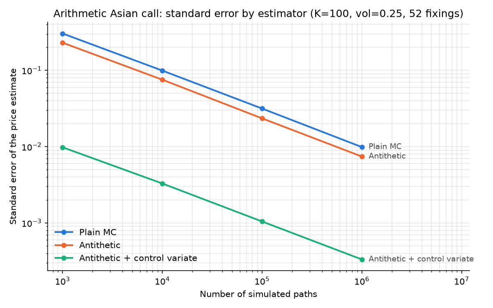

# option-pricer

A small, dependency-light option pricing library written from scratch in Python: closed-form
Black-Scholes-Merton and Black-76, a vectorised binomial tree (European and American), a
Monte Carlo engine with antithetic variates, and arithmetic Asian options priced by Monte
Carlo with a geometric control variate. Every pricer is cross-validated against at least one other
method rather than against hard-coded expected values.

Built as a personal project to work through the numerical side of derivatives pricing —
the emphasis is on correctness and validation, not on breadth of instrument coverage.

## Methods implemented

| Method | Function | Instruments | Notes |
|---|---|---|---|
| Black-Scholes-Merton | `bsm_price` | European call / put | Continuous dividend yield `q` |
| Analytical Greeks | `bsm_greeks` | European call / put | Delta, gamma, vega, theta, rho |
| Implied volatility | `implied_vol` | European call / put | Brent's method, with no-arbitrage bound checks |
| Binomial tree (CRR) | `binomial_price` | European **and American** | Vectorised backward induction |
| Monte Carlo | `mc_price` | European call / put | Antithetic variates, returns a standard error |
| Black-76 | `black76_price` | European option on a future / forward | BSM with zero cost of carry (`q = r`) |
| Geometric Asian | `geometric_asian_price` | Discrete geometric average | Exact closed form |
| Levy approximation | `levy_asian_price` | Discrete arithmetic average | Lognormal two-moment matching (Turnbull-Wakeman / Levy) |
| Asian Monte Carlo | `mc_asian_price` | Discrete arithmetic average | Antithetic + geometric control variate |

All pricing functions share the same parameter order: `S0, K, r, T, vol, q, option_type`
(spot, strike, risk-free rate, maturity in years, annualised volatility, continuous dividend
yield, `"call"`/`"put"`). Black-76 takes the futures price `F0` in place of `S0` and has no `q`;
the Asian pricers take `n_fixings` (equally spaced averaging dates `t_i = i·T/n`) after
`option_type`.

## Installation

```bash
git clone https://github.com/petritarifi/option-pricer.git
cd option-pricer
python -m venv venv && source venv/bin/activate
pip install -r requirements.txt
```

Developed on Python 3.13 (NumPy 2.5, SciPy 1.18); requires Python 3.10+.

## Usage

```python
from optionpricer.models.black_scholes import bsm_price, bsm_greeks, implied_vol
from optionpricer.models.binomial import binomial_price
from optionpricer.models.monte_carlo import mc_price

S0, K, r, T, vol, q = 100, 105, 0.03, 1.0, 0.25, 0.01

bsm_price(S0, K, r, T, vol, q, "call")
# 8.6124

bsm_greeks(S0, K, r, T, vol, q, "call")
# {'delta': 0.4989, 'gamma': 0.0158, 'vega': 39.4954, 'theta': -5.6764, 'rho': 41.2787}

# Recover the volatility implied by an observed market price
implied_vol(8.6124, S0, K, r, T, q, "call")
# 0.2500

# Monte Carlo returns (price, standard_error)
mc_price(S0, K, r, T, vol, q, "call", n_paths=1_000_000, seed=42)
# (8.6204, 0.0133)
```

The binomial tree additionally prices American exercise, and recovers the early-exercise
premium that the closed-form Black-Scholes price cannot capture:

```python
binomial_price(S0, K, r, T, vol, 1000, q, "put", "european")   # 11.5032
binomial_price(S0, K, r, T, vol, 1000, q, "put", "american")   # 11.7939
# early-exercise premium ≈ 0.29
```

### Black-76 and Asian options

Commodity options are mostly written on futures, and most oil swaps and OTC options settle on
the monthly average of a reference price (Platts, Argus) rather than on a single fixing. The
average matches the way physical cargoes are priced and blunts the impact of a one-off price
move or manipulation on a given day.

```python
from optionpricer.models.black_scholes import black76_price
from optionpricer.models.asian import geometric_asian_price, levy_asian_price, mc_asian_price

# Option on a futures price (e.g. a crude contract at 80, strike 75)
black76_price(80, 75, 0.04, 0.5, 0.35, "call")
# 10.1832

# Monthly average price option on a WTI future: 21 daily fixings.
# An airline capping its average March fuel cost is long this call.
F0, K, r, vol = 75.0, 75.0, 0.04, 0.35
T = 21 / 252
p = dict(S0=F0, K=K, r=r, T=T, vol=vol, q=r, option_type="call", n_fixings=21)

mc_asian_price(**p, n_paths=1_000_000, seed=42)   # (1.8011, 0.00004)
levy_asian_price(**p)                             # 1.8020  (analytical approximation)
geometric_asian_price(**p)                        # 1.7690  (exact, lower bound: AM ≥ GM)
black76_price(F0, K, r, T, vol, "call")           # 3.0117  (European on the same future)
```

The underlying is a futures price, not a stock. The Asian pricers let the underlying drift at
`r - q`, but a future has zero drift under the risk-neutral measure. So the example sets
`q = r` and passes the futures price as `S0`, which is what `black76_price` does internally.
Averaging over the month cuts the premium to about 60% of the European option on the same
future: the average is less volatile than the price on any single day.

The arithmetic average of lognormal prices has no closed-form distribution, hence Monte Carlo.
The geometric average is exactly lognormal, so its price is known in closed form, and its payoff
is almost perfectly correlated with the arithmetic one. That makes it a near-ideal control variate:
`Y - b·(X - E[X])`, with `b = Cov(Y, X) / Var(X)` estimated on the same paths.

The binomial tree also prices futures options: with `q = r` the risk-neutral drift is zero,
which is the futures dynamics. `binomial_price(80, 75, 0.04, 0.5, 0.35, 1000, 0.04, "call",
"american")` gives the early-exercise value of an American option on a future (10.2294 vs
10.1832 European). Unlike a call on a non-dividend-paying stock, that premium is not zero.

## Validation

The three methods are independent implementations, so agreement between them is the main
correctness check. On the European call above:

| Method | Price | Error vs BSM |
|---|---|---|
| Black-Scholes-Merton (closed form) | 8.6124 | — |
| Binomial tree, 1 000 steps | 8.6114 | 1.0e-3 |
| Monte Carlo, 10⁶ paths, antithetic | 8.6204 ± 0.0133 | 0.6 standard errors |

The test suite (`pytest`, 28 tests) enforces this rather than checking for absence of crashes:

- **Monte Carlo vs Black-Scholes** — the pricing error must fall within 3 standard errors,
  for both calls and puts.
- **Put-call parity** — `C - P = S0·e^(-qT) - K·e^(-rT)`, an independent non-regression check.
- **Analytical delta vs finite differences** — central difference on `bsm_price`.
- **Implied volatility round-trip** — price an option at a known volatility, then recover it
  to 1e-6.
- **Variance reduction** — antithetic sampling must actually lower the standard error.
- **Black-76** — equals BSM on spot once `F0 = S0·e^((r-q)T)`, satisfies futures put-call
  parity `C - P = e^(-rT)·(F0 - K)`, and matches the CRR tree run with `q = r`.
- **Asian, degenerate case** — with a single fixing the average is `S_T`, so the geometric and
  Levy formulas must both collapse to BSM exactly.
- **Asian, geometric closed form** — the closed-form geometric price (the `E[X]` of the
  control variate) must agree with a plain Monte Carlo of the geometric-average option.
- **Asian, control variate** — a separate check: the control-variate estimator must agree with
  a plain Monte Carlo of the arithmetic-average option on independent paths.
- **Asian, variance reduction** — the control variate must cut the standard error by at least
  10× relative to antithetic sampling alone.
- **Asian, AM ≥ GM** — the arithmetic call must price above the geometric call, and the
  arithmetic put below the geometric put.
- **Input validation** — out-of-bounds prices and unknown option types must raise `ValueError`.

```bash
pytest
```

### Monte Carlo convergence

`python -m optionpricer.scripts.plot_mc_convergence` reproduces the figure below: the Monte
Carlo estimate and its 95% confidence band converging on the closed-form price as the number
of simulated paths grows from 10² to 10⁶.


### Asian options: variance reduction

`python -m optionpricer.scripts.asian_variance_reduction` measures the standard error of each
estimator at the same number of paths (ATM arithmetic call, vol 25%, 52 weekly fixings,
10⁵ paths). The variance reduction factor is `(stderr_plain / stderr)²`, i.e. how many times
more plain Monte Carlo paths would be needed for the same precision.

| Estimator | Price | Stderr | Variance reduction |
|---|---|---|---|
| Plain Monte Carlo | 6.5702 | 0.0316 | 1× |
| Antithetic | 6.5007 | 0.0235 | 2× |
| Geometric control variate | 6.4985 | 0.0011 | 866× |
| Antithetic + control variate | 6.4971 | 0.0010 | 913× |

Antithetic sampling only cancels the part of the payoff that is odd in the Gaussian shocks,
while the control variate absorbs almost all of the variance. Once the control variate is on,
adding antithetic sampling barely changes the result.

Unbiasedness was checked over 40 independent seeds with two separate tests: (1) the
closed-form geometric price against a plain Monte Carlo of the geometric-average option, and
(2) the control-variate estimator against a plain Monte Carlo of the arithmetic-average option.
In both cases, the z-scores are centred on 0 with a standard deviation of about 1 (mean −0.08
and +0.04, standard deviation 0.99 and 1.07; the same script reproduces them).



The Levy approximation is an independent check, but unlike the geometric formula it is not
exact: it replaces the arithmetic average by a lognormal with the same first two moments, and so
misses the average's true skew. Against the control-variate Monte Carlo (10⁶ paths, ATM, 52
fixings), its error is systematic and grows with volatility:

| Vol | Monte Carlo (± stderr) | Levy | Levy error |
|---|---|---|---|
| 10% | 3.1163 ± 0.0001 | 3.1207 | +0.14% |
| 20% | 5.3637 ± 0.0002 | 5.3795 | +0.29% |
| 30% | 7.6300 ± 0.0005 | 7.6710 | +0.54% |
| 50% | 12.1455 ± 0.0015 | 12.3051 | +1.31% |

This is why the Levy test uses a relative tolerance rather than a z-score: with a precise
enough Monte Carlo, the approximation error is many standard errors wide.

## Project structure

```
optionpricer/
├── models/
│   ├── black_scholes.py   # bsm_price, d1_d2, bsm_greeks, implied_vol, black76_price
│   ├── binomial.py        # binomial_price (European + American)
│   ├── monte_carlo.py     # mc_price (antithetic variates)
│   └── asian.py           # geometric_asian_price, levy_asian_price, mc_asian_price
└── scripts/
    ├── plot_mc_convergence.py
    └── asian_variance_reduction.py
tests/
├── test_black_scholes.py
├── test_monte_carlo.py
└── test_asian.py
```

## Roadmap

- Longstaff-Schwartz Monte Carlo for American options (regression on the continuation value)
- Finite-difference Greeks, reusable across the binomial and Monte Carlo pricers
- Simplified CVA: simulated credit exposure `max(V(t), 0)` combined with a default probability

## Implementation notes

- The pricing code is vectorised with NumPy; the only explicit loop is the binomial backward
  induction, which is inherently sequential.
- Monte Carlo standard errors are computed from the antithetic **pair averages**, not from the
  pooled sample — antithetic draws are negatively correlated by construction, and treating
  them as independent reports a confidence interval that is too wide and hides the variance
  reduction entirely.
- The Asian Monte Carlo accumulates the running arithmetic and geometric averages while stepping
  through the fixings, so memory is `O(n_paths)` rather than `O(n_paths × n_fixings)`.
- The control-variate coefficient `b` is estimated on the same paths it corrects. This adds a
  bias of order `1/n_paths`, far below the standard error. The no-bias test checks this.
- Invalid inputs raise `ValueError` with an explicit message rather than surfacing a cryptic
  NumPy or SciPy exception.
