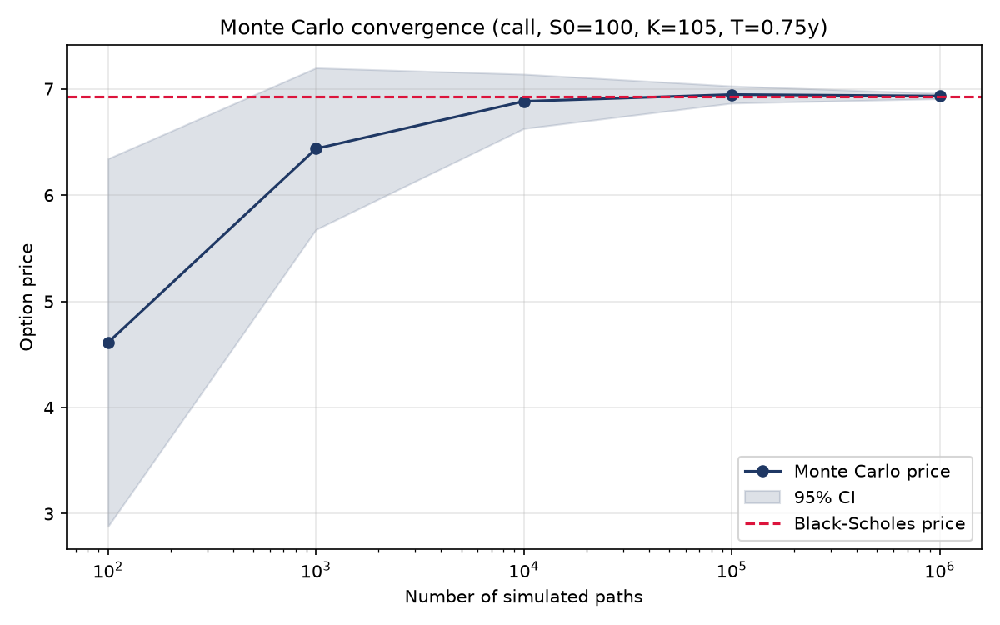

# option-pricer

A small, dependency-light option pricing library written from scratch in Python: closed-form
Black-Scholes-Merton, a vectorised binomial tree (European and American), and a Monte Carlo
engine with antithetic variates. Every pricer is cross-validated against at least one other
method rather than against hard-coded expected values.

Built as a personal project to work through the numerical side of derivatives pricing —
the emphasis is on correctness and validation, not on breadth of instrument coverage.

## Methods implemented

| Method | Function | Instruments | Notes |
|---|---|---|---|
| Black-Scholes-Merton | `bsm_price` | European call / put | Continuous dividend yield `q` |
| Analytical Greeks | `bsm_greeks` | European call / put | Delta, gamma, vega, theta, rho |
| Implied volatility | `implied_vol` | European call / put | Brent's method, with no-arbitrage bound checks |
| Binomial tree (CRR) | `binomial_price` | European **and American** | Vectorised backward induction |
| Monte Carlo | `mc_price` | European call / put | Antithetic variates, returns a standard error |

All pricing functions share the same parameter order: `S0, K, r, T, vol, q, option_type`
(spot, strike, risk-free rate, maturity in years, annualised volatility, continuous dividend
yield, `"call"`/`"put"`).

## Installation

```bash
git clone https://github.com/petritarifi/option-pricer.git
cd option-pricer
python -m venv venv && source venv/bin/activate
pip install -r requirements.txt
```

Developed on Python 3.13 (NumPy 2.5, SciPy 1.18); requires Python 3.10+.

## Usage

```python
from optionpricer.models.black_scholes import bsm_price, bsm_greeks, implied_vol
from optionpricer.models.binomial import binomial_price
from optionpricer.models.monte_carlo import mc_price

S0, K, r, T, vol, q = 100, 105, 0.03, 1.0, 0.25, 0.01

bsm_price(S0, K, r, T, vol, q, "call")
# 8.6124

bsm_greeks(S0, K, r, T, vol, q, "call")
# {'delta': 0.4989, 'gamma': 0.0158, 'vega': 39.4954, 'theta': -5.6764, 'rho': 41.2787}

# Recover the volatility implied by an observed market price
implied_vol(8.6124, S0, K, r, T, q, "call")
# 0.2500

# Monte Carlo returns (price, standard_error)
mc_price(S0, K, r, T, vol, q, "call", n_paths=1_000_000, seed=42)
# (8.6204, 0.0133)
```

The binomial tree additionally prices American exercise, and recovers the early-exercise
premium that the closed-form Black-Scholes price cannot capture:

```python
binomial_price(S0, K, r, T, vol, 1000, q, "put", "european")   # 11.5032
binomial_price(S0, K, r, T, vol, 1000, q, "put", "american")   # 11.7939
# early-exercise premium ≈ 0.29
```

## Validation

The three methods are independent implementations, so agreement between them is the main
correctness check. On the European call above:

| Method | Price | Error vs BSM |
|---|---|---|
| Black-Scholes-Merton (closed form) | 8.6124 | — |
| Binomial tree, 1 000 steps | 8.6114 | 1.0e-3 |
| Monte Carlo, 10⁶ paths, antithetic | 8.6204 ± 0.0133 | 0.6 standard errors |

The test suite (`pytest`, 10 tests) enforces this rather than checking for absence of crashes:

- **Monte Carlo vs Black-Scholes** — the pricing error must fall within 3 standard errors,
  for both calls and puts.
- **Put-call parity** — `C - P = S0·e^(-qT) - K·e^(-rT)`, an independent non-regression check.
- **Analytical delta vs finite differences** — central difference on `bsm_price`.
- **Implied volatility round-trip** — price an option at a known volatility, then recover it
  to 1e-6.
- **Variance reduction** — antithetic sampling must actually lower the standard error.
- **Input validation** — out-of-bounds prices and unknown option types must raise `ValueError`.

```bash
pytest
```

### Monte Carlo convergence

`python -m optionpricer.scripts.plot_mc_convergence` reproduces the figure below: the Monte
Carlo estimate and its 95% confidence band converging on the closed-form price as the number
of simulated paths grows from 10² to 10⁶.



## Project structure

```
optionpricer/
├── models/
│   ├── black_scholes.py   # bsm_price, d1_d2, bsm_greeks, implied_vol
│   ├── binomial.py        # binomial_price (European + American)
│   └── monte_carlo.py     # mc_price (antithetic variates)
└── scripts/
    └── plot_mc_convergence.py
tests/
├── test_black_scholes.py
└── test_monte_carlo.py
```

## Roadmap

- Longstaff-Schwartz Monte Carlo for American options (regression on the continuation value)
- Finite-difference Greeks, reusable across the binomial and Monte Carlo pricers
- Simplified CVA: simulated credit exposure `max(V(t), 0)` combined with a default probability

## Implementation notes

- The pricing code is vectorised with NumPy; the only explicit loop is the binomial backward
  induction, which is inherently sequential.
- Monte Carlo standard errors are computed from the antithetic **pair averages**, not from the
  pooled sample — antithetic draws are negatively correlated by construction, and treating
  them as independent reports a confidence interval that is too wide and hides the variance
  reduction entirely.
- Invalid inputs raise `ValueError` with an explicit message rather than surfacing a cryptic
  NumPy or SciPy exception.
